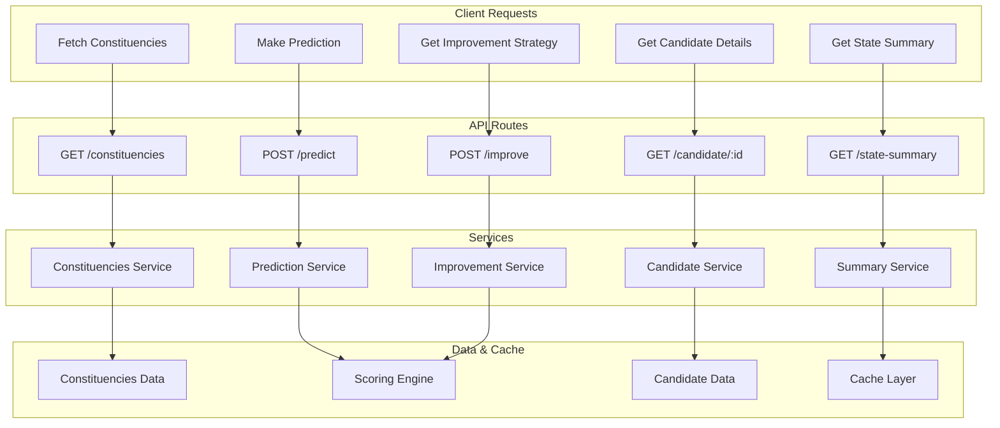
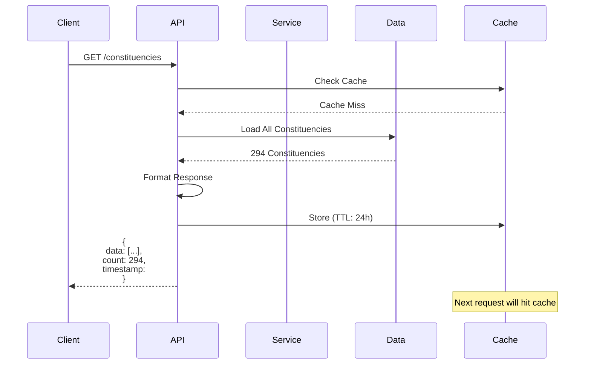
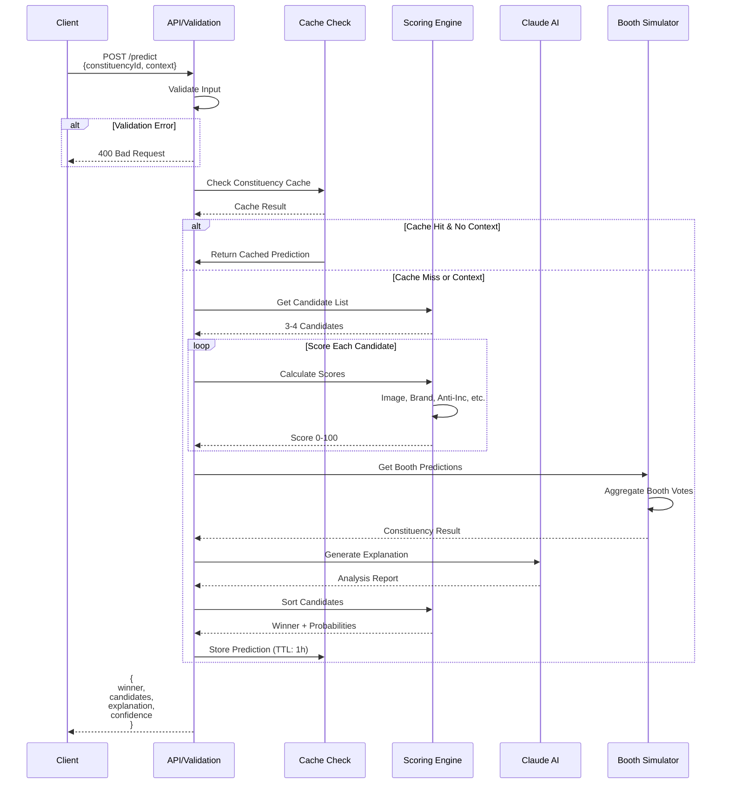
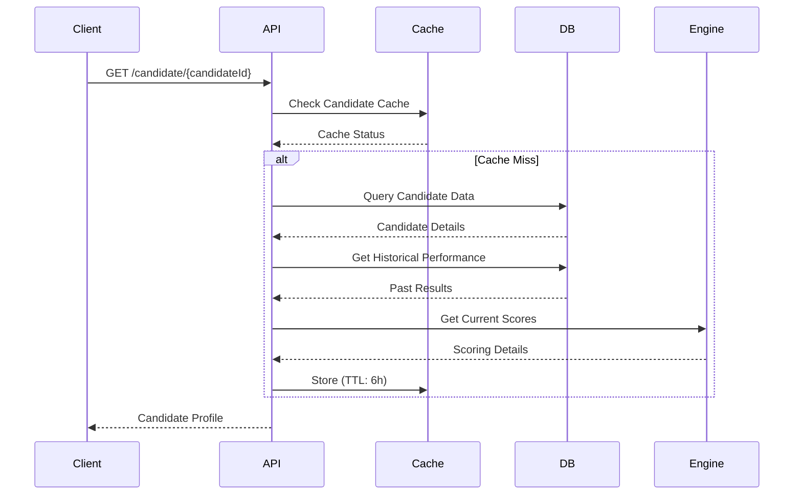
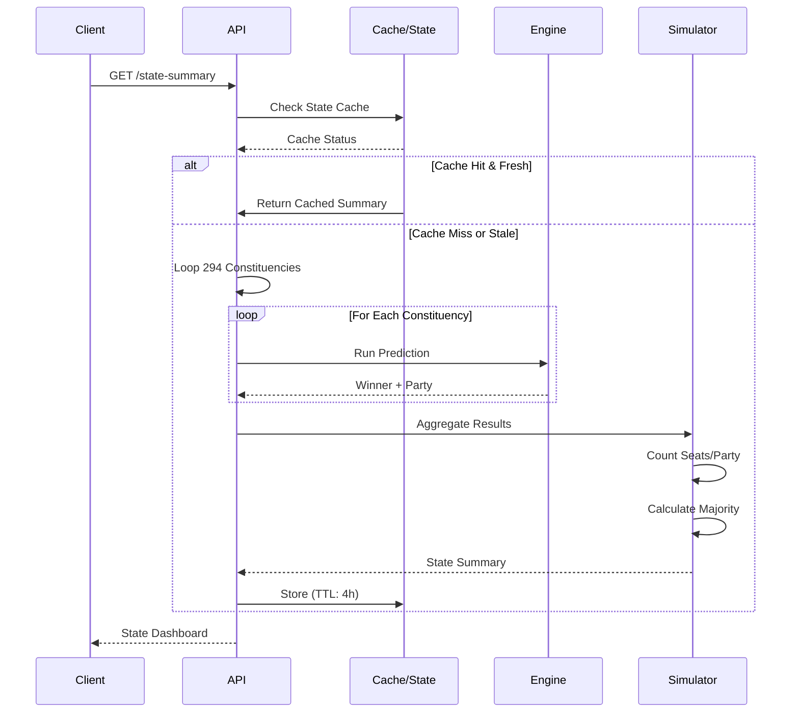
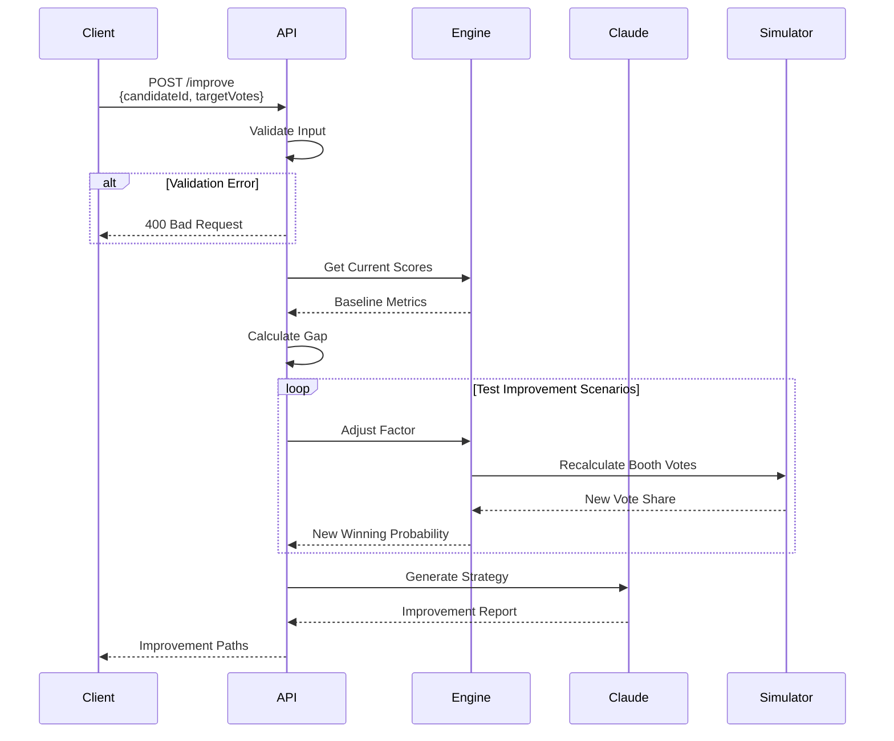
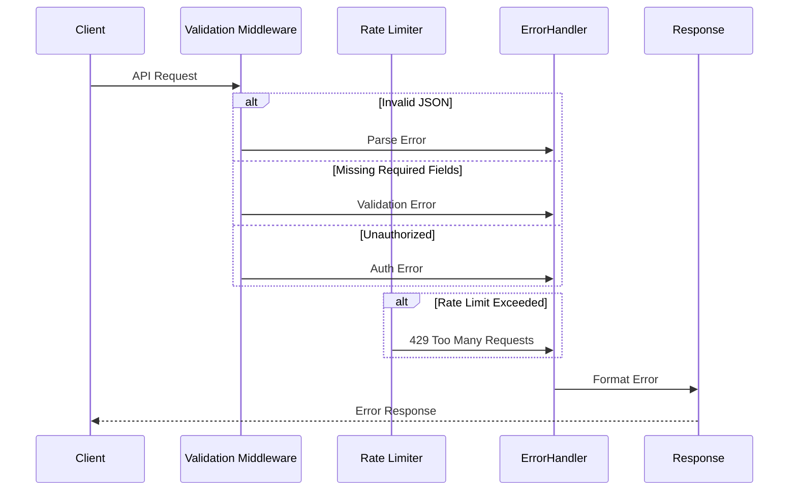
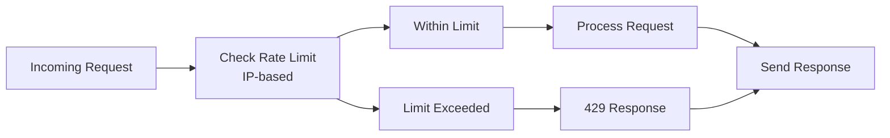

# API Flows & Endpoint Documentation

## West Bengal Assembly Election 2026 - API Specification

---

## 1. API Flow Overview



---

## 2. Constituencies Endpoint Flow



### Request/Response Example

```json
// GET /constituencies
{
  "data": [
    {
      "id": 1,
      "name": "Dum Dum",
      "district": "North 24 Parganas",
      "state": "West Bengal",
      "reservedCategory": "SC",
      "population": 450000,
      "literacyRate": 78
    },
    {
      "id": 2,
      "name": "Barrackpur",
      "district": "North 24 Parganas",
      ...
    }
  ],
  "count": 294,
  "timestamp": "2026-04-25T10:30:00Z"
}
```

---

## 3. Prediction Endpoint Flow



### Request Body
```json
POST /predict
{
  "constituencyId": 1,
  "context": "Recent local incidents affecting voter sentiment",
  "weightAdjustments": {
    "demographyMatch": 20,
    "historicalResults": 25,
    "candidateQuality": 18,
    "localLeadership": 12,
    "recentEvents": 10,
    "partyPopularity": 15
  }
}
```

### Response Body
```json
{
  "constituencyId": 1,
  "constituencyName": "Dum Dum",
  "prediction": {
    "winner": {
      "candidateId": 101,
      "name": "Candidate A",
      "party": "TMC",
      "predictedVoteShare": 42.5,
      "predictedVotes": 185000,
      "winningProbability": 78
    },
    "runners": [
      {
        "candidateId": 102,
        "name": "Candidate B",
        "party": "CPM",
        "predictedVoteShare": 35.2,
        "predictedVotes": 154000,
        "winningProbability": 18
      }
    ],
    "thirdPlace": {
      "candidateId": 103,
      "name": "Candidate C",
      "party": "BJP",
      "predictedVoteShare": 18.3,
      "predictedVotes": 80000,
      "winningProbability": 3
    }
  },
  "factors": {
    "demographyMatch": { "score": 75, "weight": 20 },
    "historicalResults": { "score": 82, "weight": 25 },
    "candidateQuality": { "score": 68, "weight": 18 },
    "localLeadership": { "score": 71, "weight": 12 },
    "recentEvents": { "score": 55, "weight": 10 },
    "partyPopularity": { "score": 79, "weight": 15 }
  },
  "aiReasoning": "Based on analysis, TMC candidate has stronger demographic appeal due to SC category reservation and improved cadre presence in urban booths. However, CPM retains significant support in rural areas.",
  "confidence": {
    "dataQuality": 85,
    "modelAccuracy": 72,
    "overallConfidence": 78
  },
  "timestamp": "2026-04-25T10:35:00Z",
  "cached": false
}
```

---

## 4. Candidate Details Endpoint Flow



### Response Example
```json
{
  "candidateId": 101,
  "name": "Candidate A",
  "party": "TMC",
  "age": 45,
  "education": "Post-Graduate",
  "criminalCases": 0,
  "popularityIndex": 8.2,
  "isLocalResident": true,
  "termCount": 2,
  "caste": "SC",
  "currentScores": {
    "candidateImage": 78,
    "partyBrand": 75,
    "antiIncumbency": 45,
    "casteEquation": 92,
    "localLeadership": 68,
    "recentEvents": 55,
    "composite": 72,
    "winningProbability": 78
  },
  "historicalPerformance": [
    { "year": 2021, "votes": 142000, "voteShare": 38.2, "position": 1 },
    { "year": 2016, "votes": 128000, "voteShare": 35.1, "position": 1 }
  ],
  "strengths": [
    "Strong SC category appeal",
    "Established local network",
    "Previous electoral success"
  ],
  "weaknesses": [
    "Anti-incumbency sentiment",
    "Urban vote erosion"
  ],
  "improvementPaths": [
    "Strengthen urban campaign",
    "Address local grievances"
  ]
}
```

---

## 5. State Summary Endpoint Flow



### Response Example
```json
{
  "statewide": {
    "totalSeats": 294,
    "resultsGenerated": 294,
    "timestamp": "2026-04-25T11:00:00Z"
  },
  "partyProjection": [
    {
      "party": "TMC",
      "predictedSeats": 156,
      "projectionRange": "140-170",
      "voteShare": 42.3,
      "majoritySeatCount": 148,
      "probabilityOfMajority": 85
    },
    {
      "party": "INDIA",
      "predictedSeats": 95,
      "projectionRange": "80-110",
      "voteShare": 35.8,
      "probabilityOfMajority": 12
    },
    {
      "party": "BJP",
      "predictedSeats": 38,
      "projectionRange": "25-50",
      "voteShare": 18.2,
      "probabilityOfMajority": 2
    },
    {
      "party": "Others",
      "predictedSeats": 5,
      "voteShare": 3.7
    }
  ],
  "scenarioAnalysis": {
    "baseCase": { "tmc": 156, "india": 95, "bjp": 38 },
    "optimisticTMC": { "tmc": 170, "india": 80, "bjp": 38 },
    "pessimisticTMC": { "tmc": 140, "india": 110, "bjp": 38 }
  },
  "majorityProbability": 0.85,
  "expectedWinner": "TMC"
}
```

---

## 6. Improvement Strategy Endpoint Flow



### Request/Response
```json
POST /improve
{
  "candidateId": 101,
  "targetVotes": 200000
}

Response:
{
  "candidateId": 101,
  "currentPrediction": {
    "predictedVotes": 185000,
    "winningProbability": 78
  },
  "targetVotes": 200000,
  "improvementNeeded": 15000,
  "strategies": [
    {
      "factor": "candidateQuality",
      "currentScore": 68,
      "improvement": 10,
      "newProbability": 82,
      "actions": [
        "Increase media appearances",
        "Strengthen grassroots campaigning"
      ]
    },
    {
      "factor": "localLeadership",
      "currentScore": 71,
      "improvement": 8,
      "newProbability": 79,
      "actions": [
        "Build alliance with local leaders",
        "Address block-level grievances"
      ]
    }
  ]
}
```

---

## 7. Error Handling Flows



### Error Response Format
```json
{
  "error": true,
  "message": "Validation Error",
  "code": "INVALID_INPUT",
  "statusCode": 400,
  "details": {
    "field": "constituencyId",
    "issue": "Required field missing"
  },
  "timestamp": "2026-04-25T10:35:00Z"
}
```

---

## 8. Caching Strategy by Endpoint

| Endpoint | Cache Key | TTL | Invalidation |
|----------|-----------|-----|--------------|
| GET /constituencies | `all_constituencies` | 24h | Manual |
| POST /predict | `prediction_{constituency}_{context_hash}` | 1h | Context change |
| GET /candidate/:id | `candidate_{candidateId}` | 6h | Manual |
| GET /state-summary | `state_summary` | 4h | Hourly refresh |
| POST /improve | `not_cached` | - | Real-time compute |

---

## 9. Rate Limiting Configuration



**Configuration:**
- General Limit: 100 requests/minute per IP
- Prediction Endpoint: 30 requests/minute
- State Summary: 10 requests/minute
- Other Endpoints: 100 requests/minute

