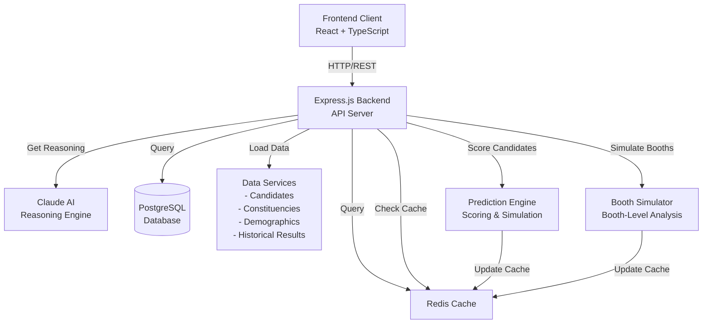
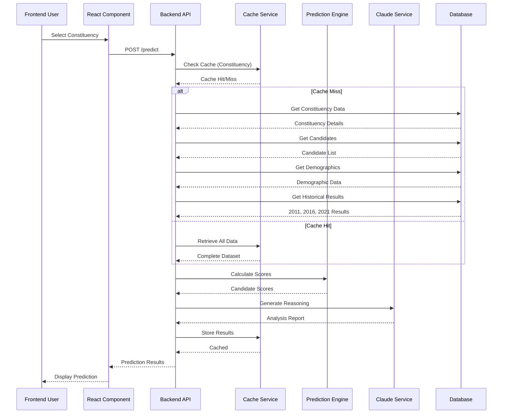
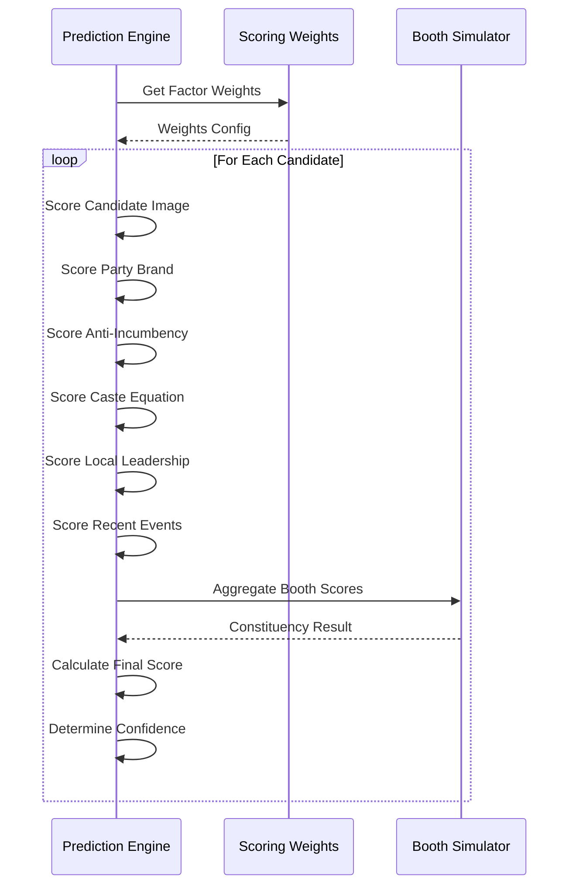
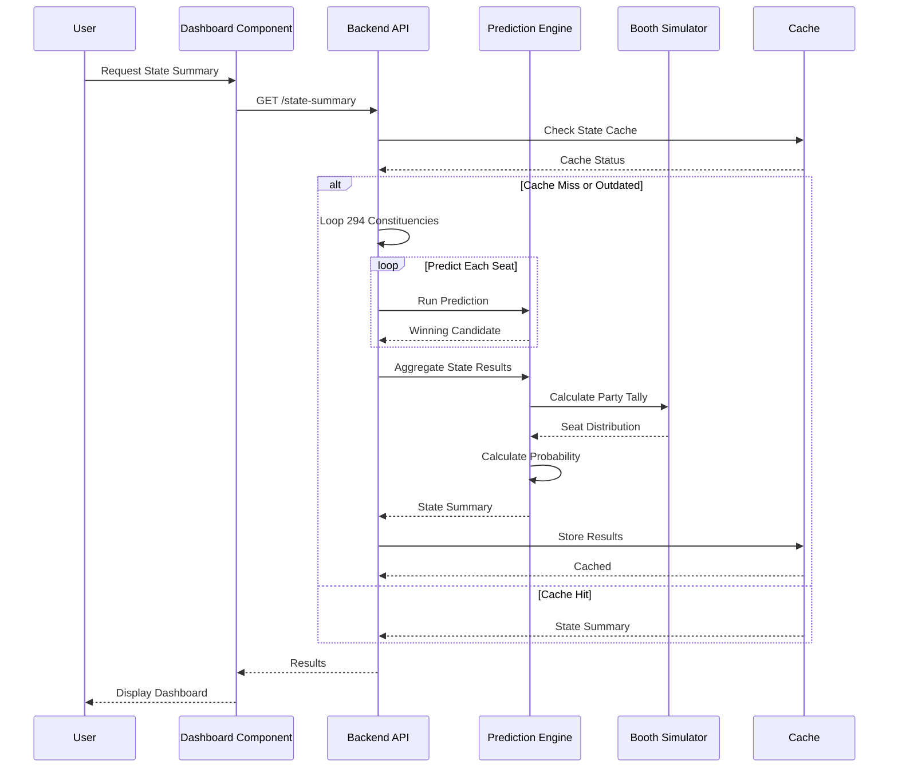
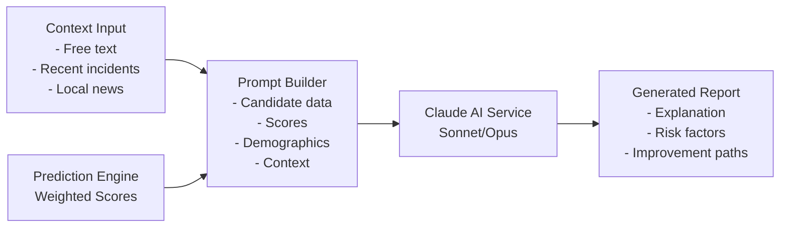
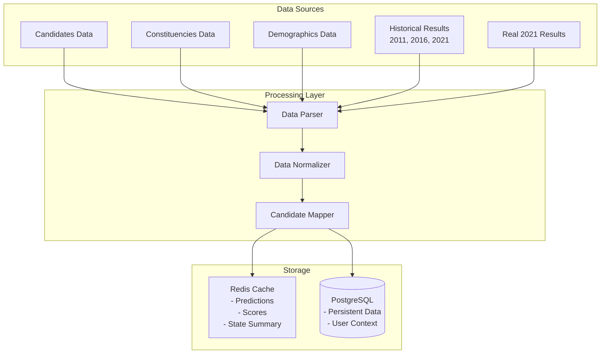
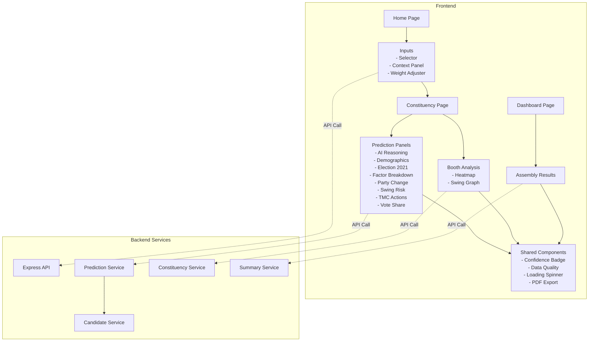
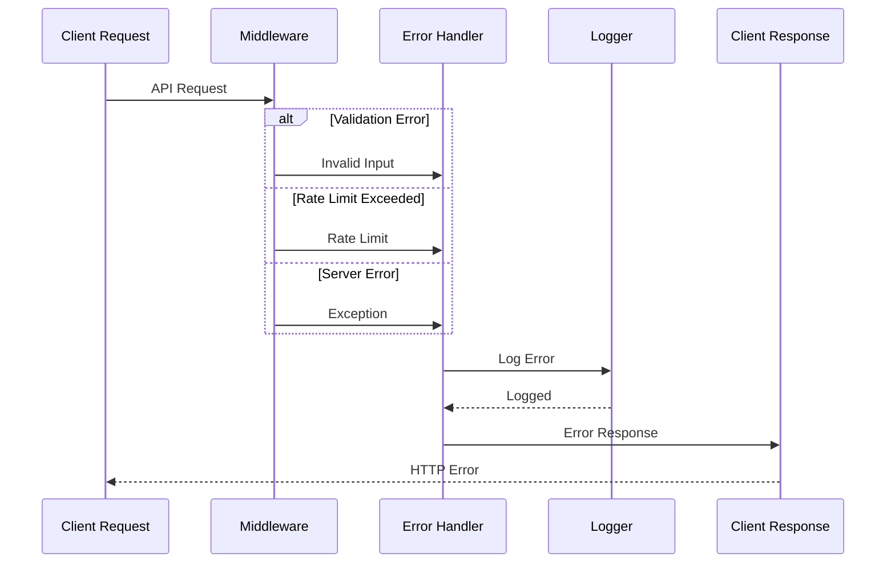
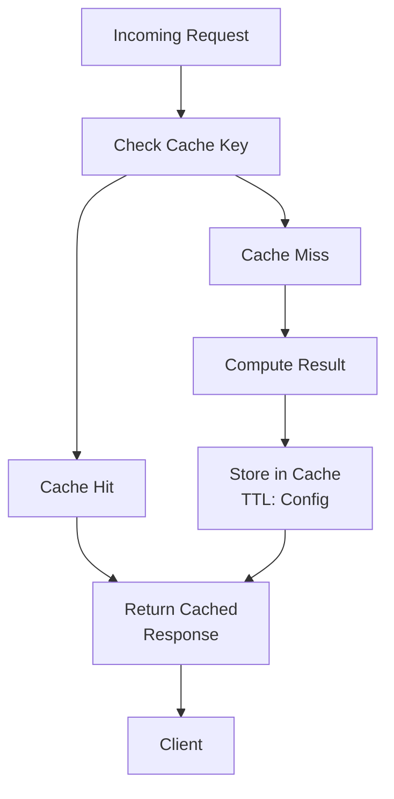
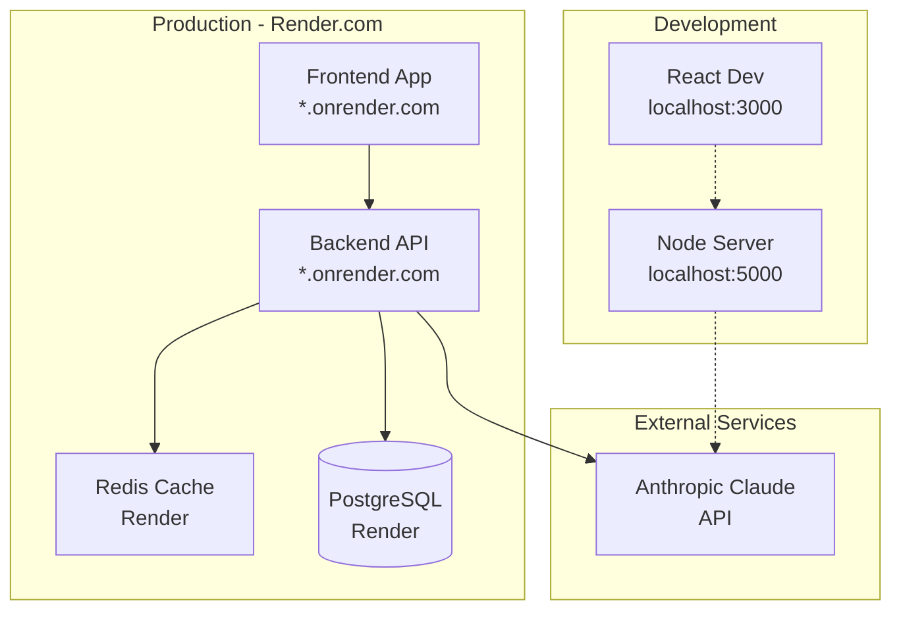

# System Architecture Documentation

## West Bengal Assembly Election 2026 Prediction System

---

## 1. System Overview

---

## 2. Request Flow Sequence Diagram

### Prediction Request Flow

---

## 3. Candidate Scoring Sequence

---

## 4. Statewide Simulation Flow

---

## 5. AI Reasoning Integration

---

## 6. Data Layer Architecture

---

## 7. Component Interaction Flow

---

## 8. Error Handling Flow

---

## 9. Caching Strategy

---

## 10. Deployment Architecture

