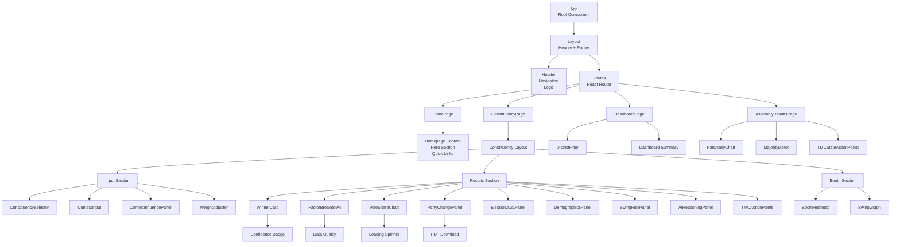
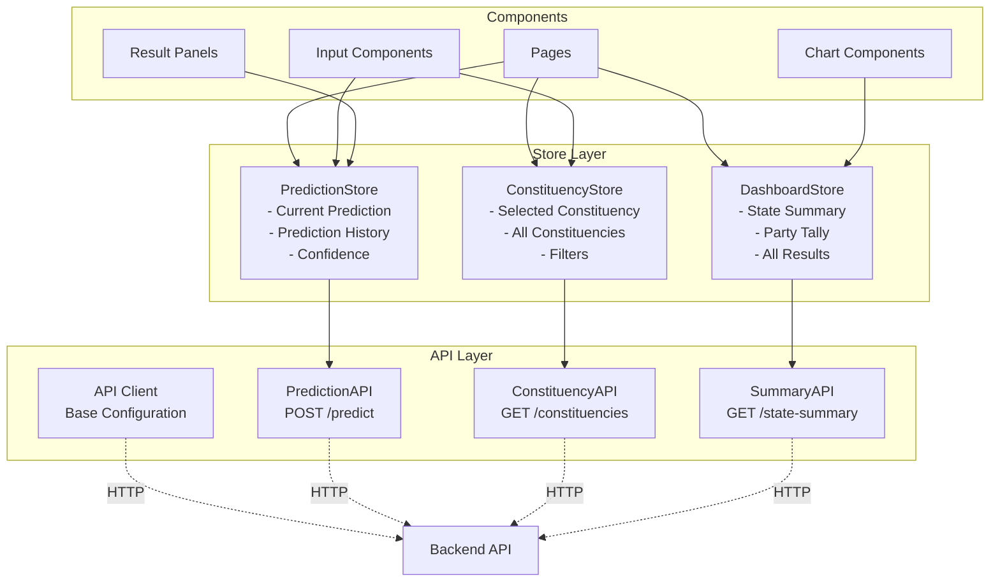
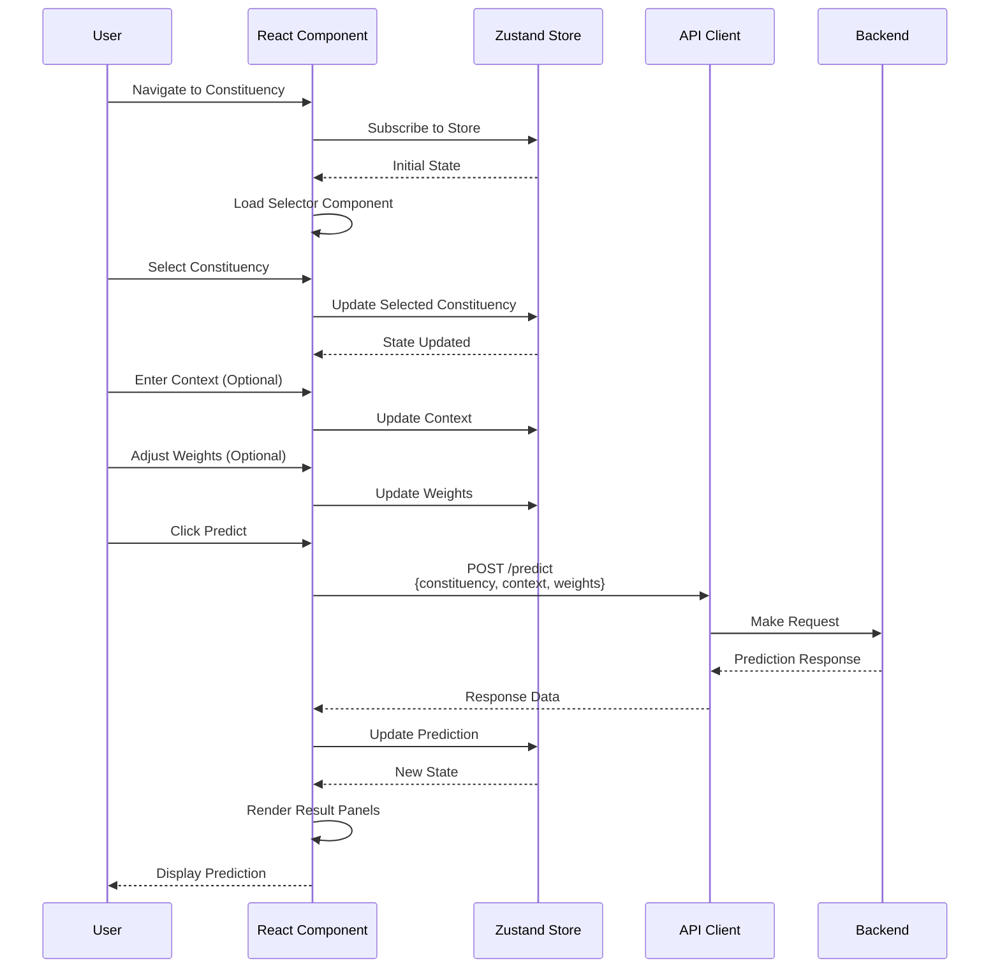
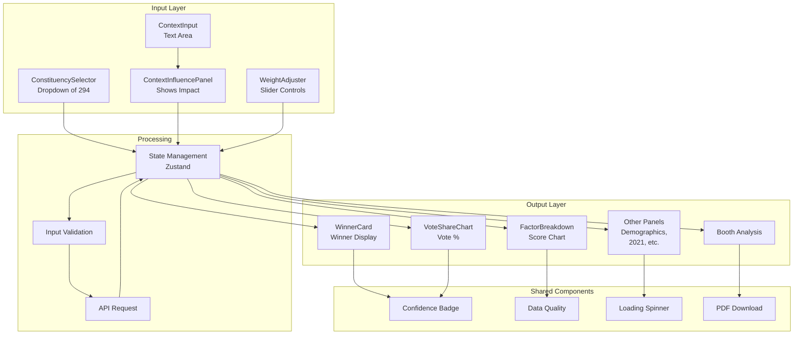
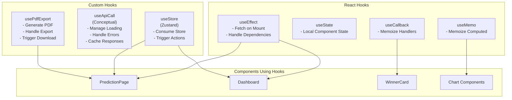
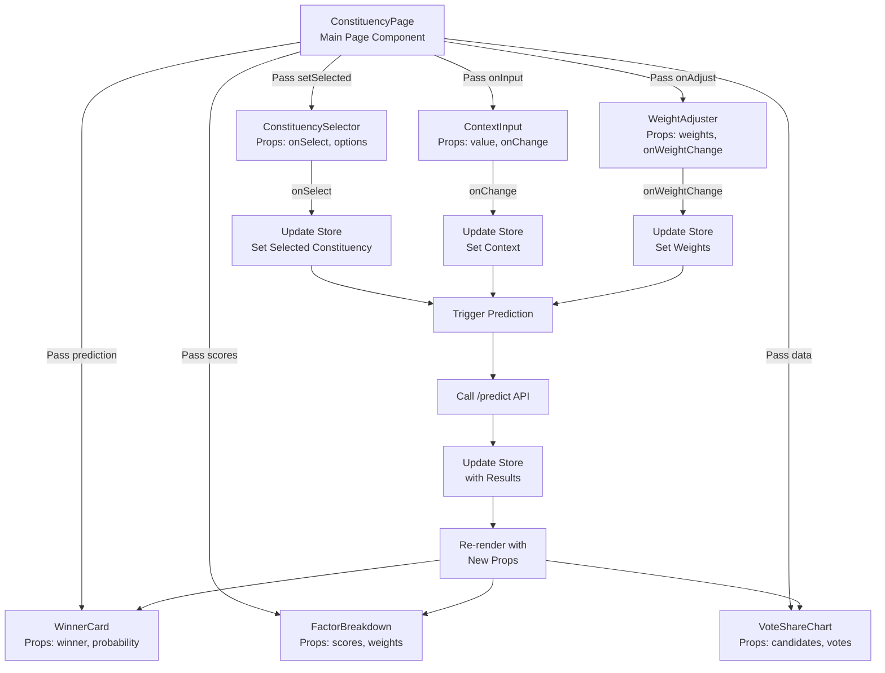
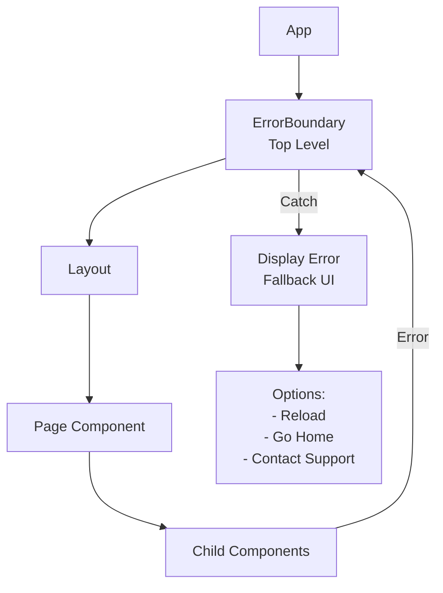
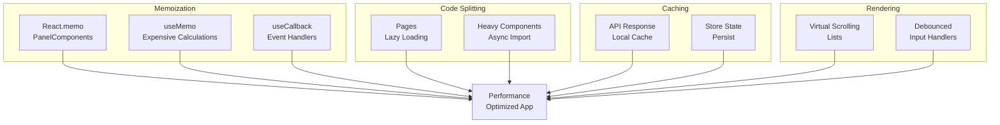
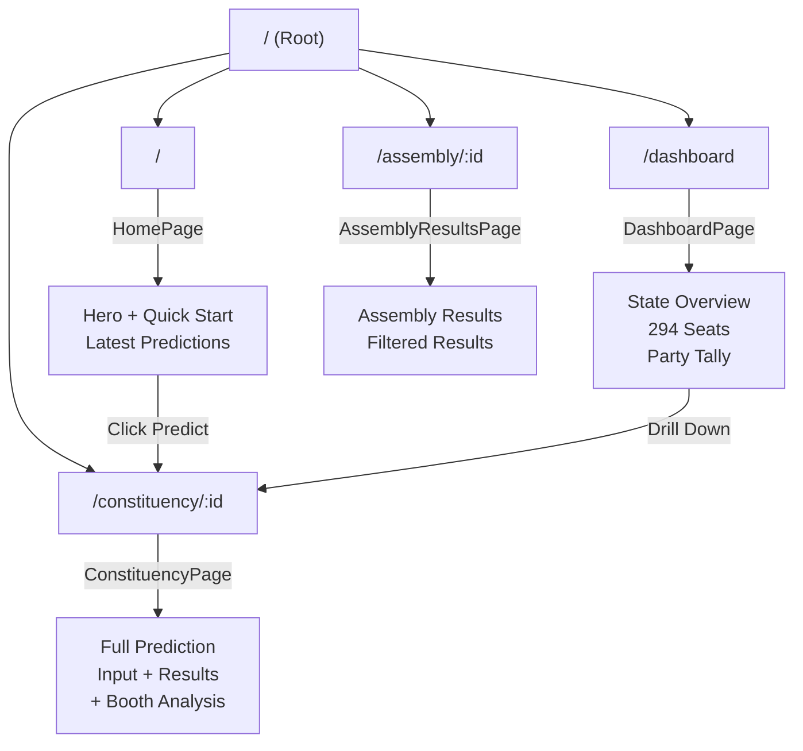

# Frontend Component Architecture

## React Component Hierarchy & Data Flow

---

## 1. Component Tree Structure

---

## 2. Data Flow Architecture

---

## 3. ConstituencyPage Data Flow

---

## 4. Component Interaction Map

---

## 5. Store Structure (Zustand)

```mermaid
graph LR
    subgraph "PredictionStore"
        PS1["State"]
        PS1 -->|currentPrediction| CurrPred["Prediction Object"]
        PS1 -->|selectedConstituency| SelConst["Constituency ID"]
        PS1 -->|context| Ctx["Context String"]
        PS1 -->|weights| Wts["Weight Adjustments"]
        PS1 -->|loading| Ld["Boolean"]
        PS1 -->|error| Err["Error Message"]
        
        PS2["Actions"]
        PS2 -->|setPrediction| SetPred["Update Prediction"]
        PS2 -->|setConstituency| SetConst["Select Constituency"]
        PS2 -->|setContext| SetCtx["Update Context"]
        PS2 -->|setWeights| SetWts["Update Weights"]
        PS2 -->|setLoading| SetLd["Toggle Loading"]
        PS2 -->|setError| SetErr["Set Error"]
    end
    
    subgraph "ConstituencyStore"
        CS1["State"]
        CS1 -->|constituencies| AllConst["Array of 294"]
        CS1 -->|selected| Sel["Selected ID"]
        CS1 -->|loading| Ld2["Boolean"]
        
        CS2["Actions"]
        CS2 -->|loadConstituencies| Load["Fetch from API"]
        CS2 -->|setSelected| SetSel["Set Selected"]
    end
    
    subgraph "DashboardStore"
        DS1["State"]
        DS1 -->|stateSummary| Summary["State Data"]
        DS1 -->|partyTally| Tally["Party Seats"]
        
        DS2["Actions"]
        DS2 -->|loadSummary| LoadSum["Fetch Summary"]
    end
```

---

## 6. Hooks Usage

---

## 7. Props Flow Example: ConstituencyPage

---

## 8. Error Boundary Strategy

---

## 9. Performance Optimization Strategies

---

## 10. Routing Map

