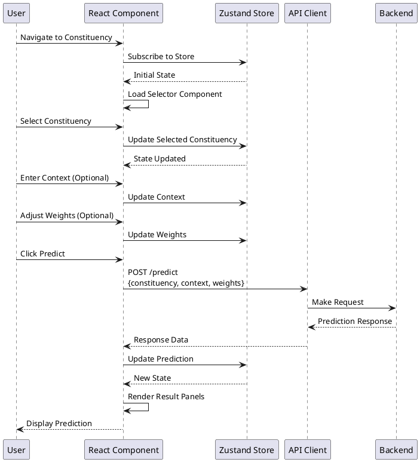
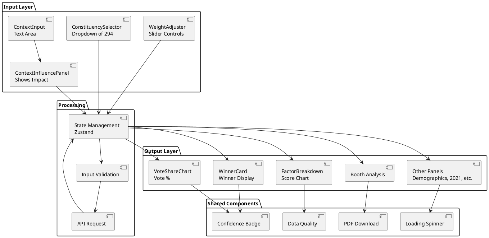
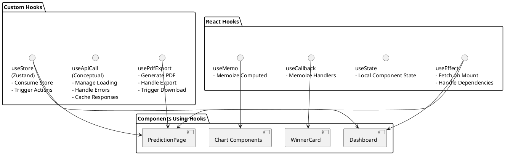
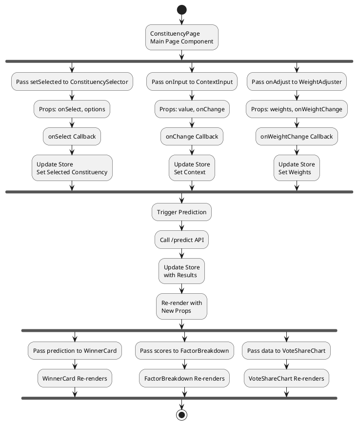
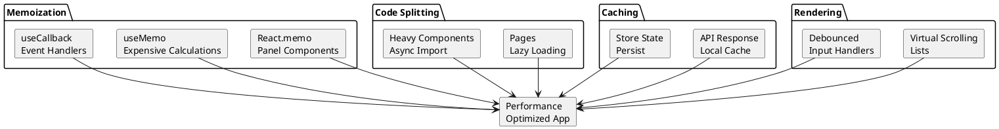
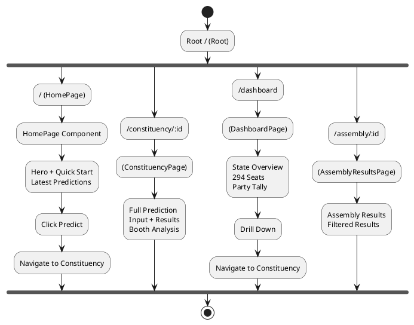

# Frontend Component Architecture (PlantUML Format)

## React Component Hierarchy & Data Flow

---

## 1. Component Tree Structure

```plantuml
@startuml Component_Tree
!define COMPONENT(name) class name
!define PAGE(name) class name {
  {field} Page Component
}

package "Application" {
  component App as "App\nRoot Component"
  component Layout as "Layout\nHeader + Router"
  component Header as "Header\nNavigation\nLogo"
  component Routes as "Routes\nReact Router"
  
  App --> Layout
  Layout --> Header
  Layout --> Routes
  
  component HomePage as "HomePage"
  component ConstituencyPage as "ConstituencyPage"
  component DashboardPage as "DashboardPage"
  component AssemblyResultsPage as "AssemblyResultsPage"
  
  Routes --> HomePage
  Routes --> ConstituencyPage
  Routes --> DashboardPage
  Routes --> AssemblyResultsPage
  
  component HomeContent as "Homepage Content\nHero Section\nQuick Links"
  HomePage --> HomeContent
  
  component ConstLayout as "Constituency Layout"
  ConstituencyPage --> ConstLayout
  
  component InputSection as "Input Section"
  component ResultsSection as "Results Section"
  component BoothSection as "Booth Section"
  
  ConstLayout --> InputSection
  ConstLayout --> ResultsSection
  ConstLayout --> BoothSection
}

package "Input Components" {
  component Selector as "ConstituencySelector"
  component ContextInput as "ContextInput"
  component ContextPanel as "ContextInfluencePanel"
  component WeightAdj as "WeightAdjuster"
  
  InputSection --> Selector
  InputSection --> ContextInput
  InputSection --> ContextPanel
  InputSection --> WeightAdj
}

package "Result Panels" {
  component Winner as "WinnerCard"
  component Factor as "FactorBreakdown"
  component VoteShare as "VoteShareChart"
  component Party as "PartyChangePanel"
  component Election as "Election2021Panel"
  component Demo as "DemographicsPanel"
  component Swing as "SwingRiskPanel"
  component AI as "AIReasoningPanel"
  component TMC as "TMCActionPoints"
  
  ResultsSection --> Winner
  ResultsSection --> Factor
  ResultsSection --> VoteShare
  ResultsSection --> Party
  ResultsSection --> Election
  ResultsSection --> Demo
  ResultsSection --> Swing
  ResultsSection --> AI
  ResultsSection --> TMC
}

package "Booth Analysis" {
  component Heatmap as "BoothHeatmap"
  component SwingGraph as "SwingGraph"
  
  BoothSection --> Heatmap
  BoothSection --> SwingGraph
}

package "Dashboard" {
  component DashFilter as "DistrictFilter"
  component DashSummary as "Dashboard Summary"
  component Tally as "PartyTallyChart"
  component Majority as "MajorityMeter"
  component StateAction as "TMCStateActionPoints"
  
  DashboardPage --> DashFilter
  DashboardPage --> DashSummary
  AssemblyResultsPage --> Tally
  AssemblyResultsPage --> Majority
  AssemblyResultsPage --> StateAction
}

package "Shared Components" {
  component Badge as "Confidence Badge"
  component Quality as "Data Quality"
  component Spinner as "Loading Spinner"
  component PDF as "PDF Download"
  
  Winner --> Badge
  Factor --> Quality
  VoteShare --> Badge
  TMC --> Spinner
  Booth --> PDF
}

@enduml
```

---

## 2. Data Flow Architecture

```plantuml
@startuml Data_Flow
!define STORE <<store>>
!define API <<api>>
!define COMPONENT <<component>>

package "Store Layer" {
  database PredStore as "PredictionStore\n- Current Prediction\n- Prediction History\n- Confidence" STORE
  database ConstStore as "ConstituencyStore\n- Selected Constituency\n- All Constituencies\n- Filters" STORE
  database DashStore as "DashboardStore\n- State Summary\n- Party Tally\n- All Results" STORE
}

package "API Layer" {
  component Client as "API Client\nBase Configuration" API
  component PredAPI as "PredictionAPI\nPOST /predict" API
  component ConstAPI as "ConstituencyAPI\nGET /constituencies" API
  component SummaryAPI as "SummaryAPI\nGET /state-summary" API
}

package "Components" {
  component Pages as "Pages" COMPONENT
  component Inputs as "Input Components" COMPONENT
  component Panels as "Result Panels" COMPONENT
  component Charts as "Chart Components" COMPONENT
}

package "Backend" {
  component Backend as "Backend API"
}

Pages --> PredStore
Pages --> ConstStore
Pages --> DashStore

PredStore --> PredAPI
ConstStore --> ConstAPI
DashStore --> SummaryAPI

PredAPI -.->|HTTP| Backend
ConstAPI -.->|HTTP| Backend
SummaryAPI -.->|HTTP| Backend
Client -.->|HTTP| Backend

Inputs --> PredStore
Inputs --> ConstStore

Panels --> PredStore
Charts --> DashStore

@enduml
```

---

## 3. ConstituencyPage Data Flow



---

## 4. Component Interaction Map



---

## 5. Store Structure (Zustand)

```plantuml
@startuml Zustand_Stores
package "PredictionStore" {
  card State as "State"
  State : currentPrediction
  State : selectedConstituency
  State : context
  State : weights
  State : loading
  State : error
  
  card Actions as "Actions"
  Actions : setPrediction(data)
  Actions : setConstituency(id)
  Actions : setContext(text)
  Actions : setWeights(weights)
  Actions : setLoading(bool)
  Actions : setError(msg)
}

package "ConstituencyStore" {
  card CSState as "State"
  CSState : constituencies[]
  CSState : selected
  CSState : loading
  
  card CSActions as "Actions"
  CSActions : loadConstituencies()
  CSActions : setSelected(id)
}

package "DashboardStore" {
  card DSState as "State"
  DSState : stateSummary
  DSState : partyTally
  
  card DSActions as "Actions"
  DSActions : loadSummary()
}

State --> Actions
CSState --> CSActions
DSState --> DSActions

@enduml
```

---

## 6. Hooks Usage



---

## 7. Props Flow Example: ConstituencyPage



---

## 8. Error Boundary Strategy

```plantuml
@startuml ErrorBoundary
card App as "App\nRoot"
card EB1 as "ErrorBoundary\nTop Level"
card Layout as "Layout"
card Page as "Page Component"
card Components as "Child Components"
card Display as "Display Error\nFallback UI"
card Options as "Options\n- Reload\n- Go Home\n- Contact Support"

App --> EB1
EB1 --> Layout
Layout --> Page
Page --> Components

Components -.->|Error| EB1
EB1 -.->|Catch| Display
Display --> Options

@enduml
```

---

## 9. Performance Optimization Strategies



---

## 10. Routing Map



---

## How to Use PlantUML Files

### Option 1: PlantUML Online Editor
1. Go to [plantexpress.web.app](https://plantexpress.web.app) or [plantuml.com/plantuml](https://www.plantuml.com/plantuml/uml/)
2. Copy any diagram code from the code blocks above
3. Paste into the editor
4. View rendered diagram

### Option 2: VS Code Extension
1. Install "PlantUML" extension by jebbs
2. Create `.puml` or `.plantuml` files
3. Right-click → "Preview"
4. View diagrams side-by-side

### Option 3: Generate as Images
```bash
# Install PlantUML CLI
npm install -g plantuml

# Generate PNG
plantuml component-architecture.puml -o ./diagrams

# Generate SVG
plantuml component-architecture.puml -tsvg -o ./diagrams
```

### Option 4: Integration in Documentation
- GitLab: Automatically renders PlantUML in markdown
- Notion: Use PlantUML embed blocks
- Confluence: Use PlantUML macro

---

## File Versions

- **Mermaid Format**: `COMPONENT_ARCHITECTURE.md` (Recommended for GitHub)
- **PlantUML Format**: `COMPONENT_ARCHITECTURE_PLANTUML.md` (This file)

Both contain identical information in different diagram syntax formats.

