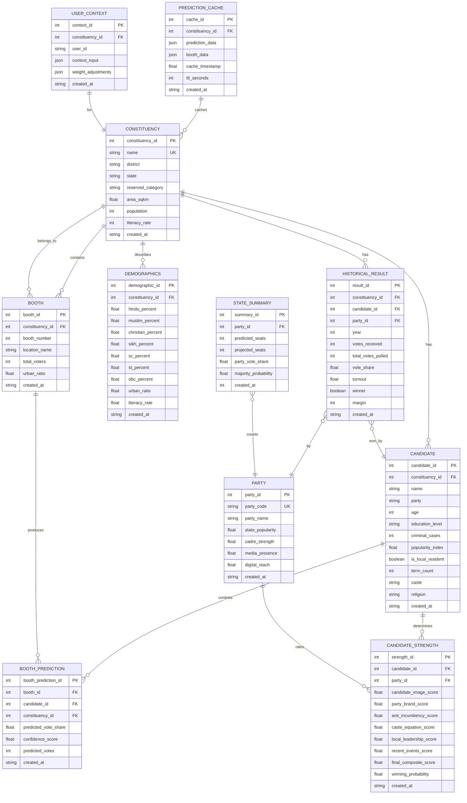
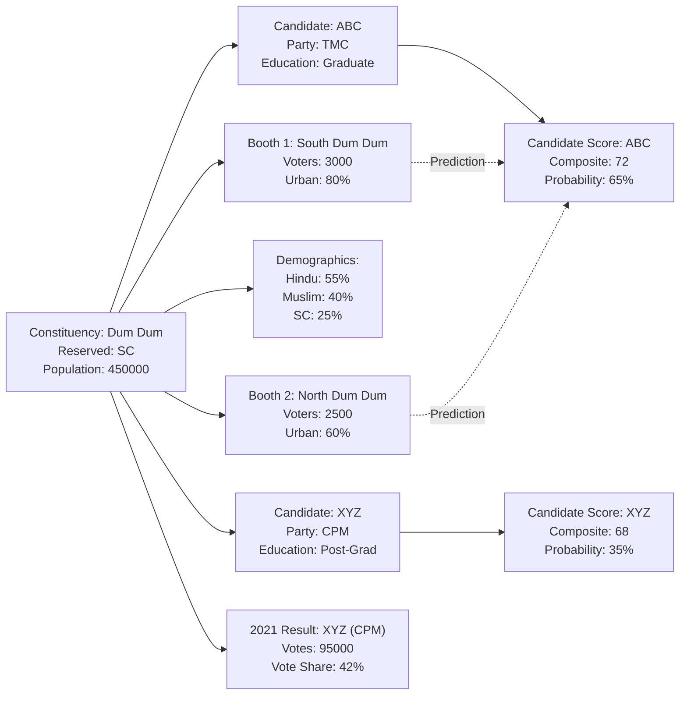

# Database Entity Relationship Diagram (ERD)

## West Bengal Assembly Election 2026 - Data Schema

---

## 1. Main ERD



---

## 2. Core Entities Description

### CONSTITUENCY
- **Purpose**: Core unit of prediction
- **Key Fields**: constituency_id, name, district, reserved_category, population
- **Relationships**: One to Many with Candidates, Booths, Demographics, Historical Results

### CANDIDATE
- **Purpose**: Political candidates contesting from constituencies
- **Key Fields**: candidate_id, name, party, education_level, criminal_cases, popularity_index
- **Relationships**: Many to One with Constituency, One to Many with Booth Predictions

### PARTY
- **Purpose**: Political party master data
- **Key Fields**: party_code, party_name, state_popularity, cadre_strength, media_presence
- **Relationships**: Many to One with Historical Results and Candidate Strength

### BOOTH
- **Purpose**: Granular voting unit for simulation
- **Key Fields**: booth_id, booth_number, location_name, total_voters
- **Relationships**: Many to One with Constituency, One to Many with Booth Predictions

### DEMOGRAPHICS
- **Purpose**: Demographic composition for scoring
- **Key Fields**: Religion percentages, SC/ST/OBC percentages, urban_ratio, literacy_rate
- **Relationships**: One to One with Constituency

### HISTORICAL_RESULT
- **Purpose**: Past election results for trend analysis
- **Key Fields**: year (2011, 2016, 2021), votes_received, vote_share, winner flag
- **Relationships**: Many to One with Constituency, Candidate, Party

### BOOTH_PREDICTION
- **Purpose**: Booth-level prediction results
- **Key Fields**: predicted_vote_share, confidence_score, predicted_votes
- **Relationships**: Many to One with Booth, Candidate, Constituency

### CANDIDATE_STRENGTH
- **Purpose**: Composite scoring matrix
- **Key Fields**: candidate_image_score, party_brand_score, anti_incumbency_score, caste_equation_score, final_composite_score, winning_probability
- **Relationships**: One to One with Candidate

### PREDICTION_CACHE
- **Purpose**: Caching layer for performance
- **Key Fields**: prediction_data (JSON), booth_data (JSON), cache_timestamp, ttl_seconds
- **Relationships**: Many to One with Constituency

---

## 3. Detailed Schema - Table Structures

### CONSTITUENCY Table
```sql
CREATE TABLE constituency (
    constituency_id INTEGER PRIMARY KEY,
    name VARCHAR(100) NOT NULL UNIQUE,
    district VARCHAR(50) NOT NULL,
    state VARCHAR(30) NOT NULL DEFAULT 'West Bengal',
    reserved_category VARCHAR(10), -- 'SC', 'ST', or NULL
    area_sqkm FLOAT,
    population INTEGER,
    literacy_rate INTEGER,
    created_at TIMESTAMP DEFAULT CURRENT_TIMESTAMP
);
```

### CANDIDATE Table
```sql
CREATE TABLE candidate (
    candidate_id INTEGER PRIMARY KEY,
    constituency_id INTEGER NOT NULL,
    name VARCHAR(100) NOT NULL,
    party VARCHAR(30) NOT NULL,
    age INTEGER,
    education_level VARCHAR(30), -- 'Post-Graduate', 'Graduate', 'Intermediate', 'Below'
    criminal_cases INTEGER DEFAULT 0,
    popularity_index FLOAT DEFAULT 5,
    is_local_resident BOOLEAN DEFAULT FALSE,
    term_count INTEGER DEFAULT 0,
    caste VARCHAR(30),
    religion VARCHAR(20),
    created_at TIMESTAMP DEFAULT CURRENT_TIMESTAMP,
    FOREIGN KEY (constituency_id) REFERENCES constituency(constituency_id)
);
```

### PARTY Table
```sql
CREATE TABLE party (
    party_id INTEGER PRIMARY KEY,
    party_code VARCHAR(10) NOT NULL UNIQUE,
    party_name VARCHAR(50) NOT NULL,
    state_popularity FLOAT DEFAULT 15,
    cadre_strength FLOAT DEFAULT 10,
    media_presence FLOAT DEFAULT 10,
    digital_reach FLOAT DEFAULT 10,
    created_at TIMESTAMP DEFAULT CURRENT_TIMESTAMP
);
```

### BOOTH Table
```sql
CREATE TABLE booth (
    booth_id INTEGER PRIMARY KEY,
    constituency_id INTEGER NOT NULL,
    booth_number INTEGER NOT NULL,
    location_name VARCHAR(100),
    total_voters INTEGER,
    urban_ratio FLOAT, -- 0-100, percentage
    created_at TIMESTAMP DEFAULT CURRENT_TIMESTAMP,
    FOREIGN KEY (constituency_id) REFERENCES constituency(constituency_id),
    UNIQUE(constituency_id, booth_number)
);
```

### DEMOGRAPHICS Table
```sql
CREATE TABLE demographics (
    demographic_id INTEGER PRIMARY KEY,
    constituency_id INTEGER NOT NULL UNIQUE,
    hindu_percent FLOAT,
    muslim_percent FLOAT,
    christian_percent FLOAT,
    sikh_percent FLOAT,
    sc_percent FLOAT,
    st_percent FLOAT,
    obc_percent FLOAT,
    urban_ratio FLOAT,
    literacy_rate INTEGER,
    created_at TIMESTAMP DEFAULT CURRENT_TIMESTAMP,
    FOREIGN KEY (constituency_id) REFERENCES constituency(constituency_id)
);
```

### HISTORICAL_RESULT Table
```sql
CREATE TABLE historical_result (
    result_id INTEGER PRIMARY KEY,
    constituency_id INTEGER NOT NULL,
    candidate_id INTEGER,
    party_id INTEGER,
    year INTEGER NOT NULL, -- 2011, 2016, 2021
    votes_received INTEGER,
    total_votes_polled INTEGER,
    vote_share FLOAT,
    turnout FLOAT,
    winner BOOLEAN DEFAULT FALSE,
    margin INTEGER,
    created_at TIMESTAMP DEFAULT CURRENT_TIMESTAMP,
    FOREIGN KEY (constituency_id) REFERENCES constituency(constituency_id),
    FOREIGN KEY (candidate_id) REFERENCES candidate(candidate_id),
    FOREIGN KEY (party_id) REFERENCES party(party_id)
);
```

### CANDIDATE_STRENGTH Table
```sql
CREATE TABLE candidate_strength (
    strength_id INTEGER PRIMARY KEY,
    candidate_id INTEGER NOT NULL UNIQUE,
    party_id INTEGER NOT NULL,
    candidate_image_score FLOAT, -- 0-100
    party_brand_score FLOAT,
    anti_incumbency_score FLOAT,
    caste_equation_score FLOAT,
    local_leadership_score FLOAT,
    recent_events_score FLOAT,
    final_composite_score FLOAT, -- 0-100
    winning_probability FLOAT, -- 0-100
    created_at TIMESTAMP DEFAULT CURRENT_TIMESTAMP,
    FOREIGN KEY (candidate_id) REFERENCES candidate(candidate_id),
    FOREIGN KEY (party_id) REFERENCES party(party_id)
);
```

### BOOTH_PREDICTION Table
```sql
CREATE TABLE booth_prediction (
    booth_prediction_id INTEGER PRIMARY KEY,
    booth_id INTEGER NOT NULL,
    candidate_id INTEGER NOT NULL,
    constituency_id INTEGER NOT NULL,
    predicted_vote_share FLOAT, -- percentage
    confidence_score FLOAT, -- 0-100
    predicted_votes INTEGER,
    created_at TIMESTAMP DEFAULT CURRENT_TIMESTAMP,
    FOREIGN KEY (booth_id) REFERENCES booth(booth_id),
    FOREIGN KEY (candidate_id) REFERENCES candidate(candidate_id),
    FOREIGN KEY (constituency_id) REFERENCES constituency(constituency_id)
);
```

### PREDICTION_CACHE Table
```sql
CREATE TABLE prediction_cache (
    cache_id INTEGER PRIMARY KEY,
    constituency_id INTEGER NOT NULL,
    prediction_data JSONB, -- Full prediction response
    booth_data JSONB,
    cache_timestamp TIMESTAMP DEFAULT CURRENT_TIMESTAMP,
    ttl_seconds INTEGER DEFAULT 3600,
    created_at TIMESTAMP DEFAULT CURRENT_TIMESTAMP,
    FOREIGN KEY (constituency_id) REFERENCES constituency(constituency_id)
);
```

### USER_CONTEXT Table
```sql
CREATE TABLE user_context (
    context_id INTEGER PRIMARY KEY,
    constituency_id INTEGER NOT NULL,
    user_id VARCHAR(100),
    context_input JSONB, -- Free-text and additional context
    weight_adjustments JSONB, -- User's factor weight adjustments
    created_at TIMESTAMP DEFAULT CURRENT_TIMESTAMP,
    FOREIGN KEY (constituency_id) REFERENCES constituency(constituency_id)
);
```

---

## 4. Index Strategy

```sql
-- Performance Indexes
CREATE INDEX idx_candidate_constituency ON candidate(constituency_id);
CREATE INDEX idx_candidate_party ON candidate(party);
CREATE INDEX idx_booth_constituency ON booth(constituency_id);
CREATE INDEX idx_historical_constituency ON historical_result(constituency_id);
CREATE INDEX idx_historical_year ON historical_result(year);
CREATE INDEX idx_historical_party ON historical_result(party_id);
CREATE INDEX idx_booth_prediction_candidate ON booth_prediction(candidate_id);
CREATE INDEX idx_booth_prediction_constituency ON booth_prediction(constituency_id);
CREATE INDEX idx_cache_constituency ON prediction_cache(constituency_id);
CREATE INDEX idx_context_constituency ON user_context(constituency_id);
```

---

## 5. Sample Data Model Relationships



