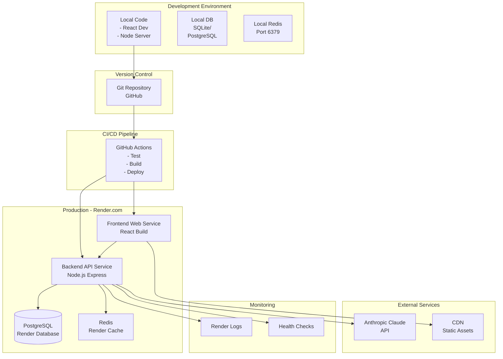
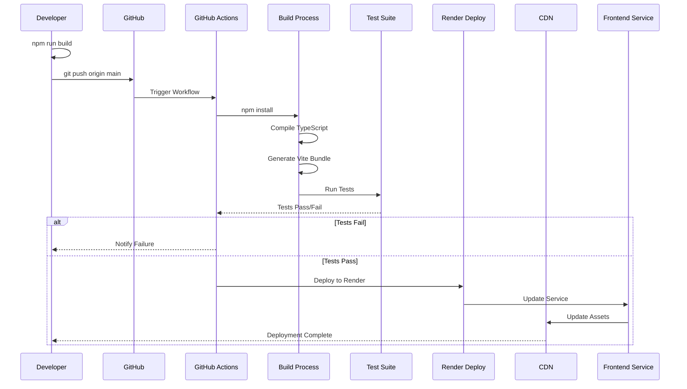
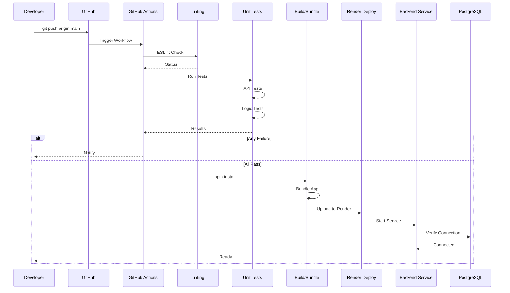
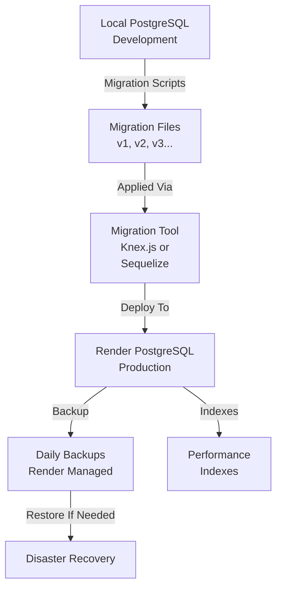
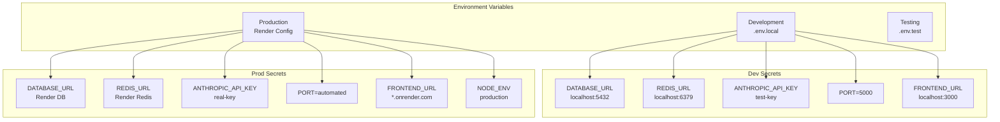
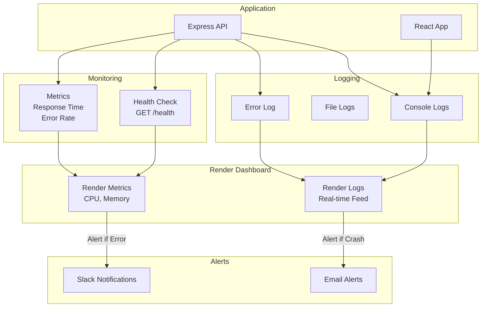
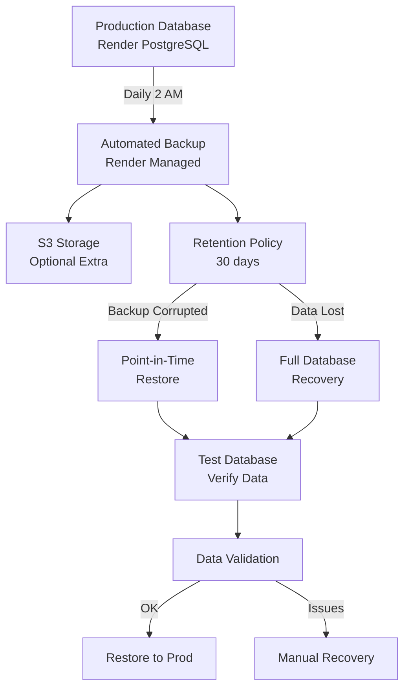
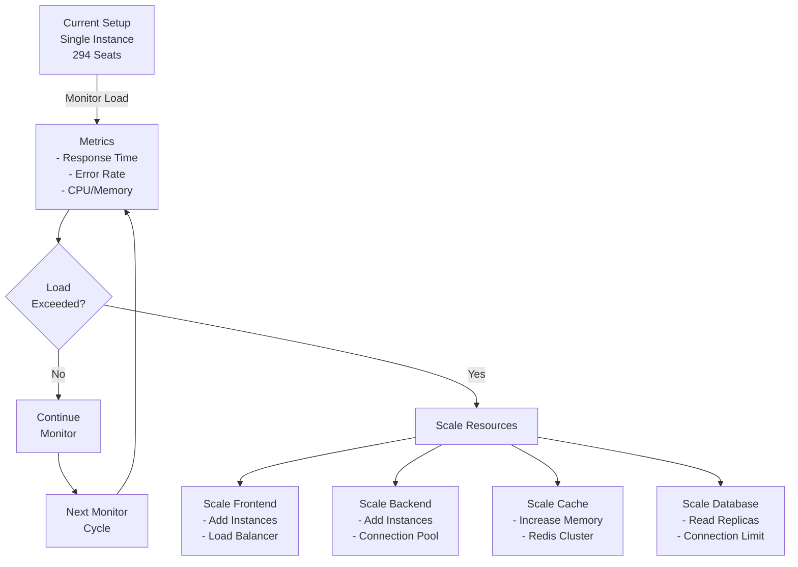
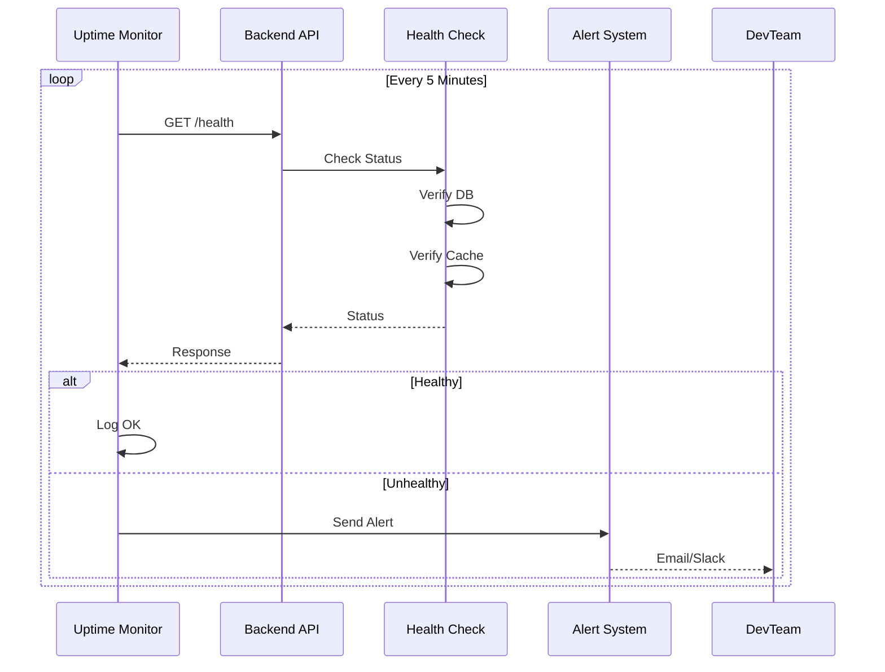

# Deployment & Infrastructure Architecture

## West Bengal Assembly Election 2026 - Deployment Guide

---

## 1. Deployment Architecture Overview



---

## 2. Frontend Deployment Pipeline



---

## 3. Backend Deployment Pipeline



---

## 4. Database Deployment



---

## 5. Environment Configuration



---

## 6. Monitoring & Logging Stack



---

## 7. CI/CD Workflow Configuration

```yaml
# .github/workflows/deploy.yml
name: Deploy to Render

on:
  push:
    branches: [main]
  pull_request:
    branches: [main]

jobs:
  test:
    runs-on: ubuntu-latest
    steps:
      - uses: actions/checkout@v2
      
      - name: Setup Node.js
        uses: actions/setup-node@v2
        with:
          node-version: '18'
      
      - name: Install Dependencies
        run: npm install
      
      - name: Run Linting
        run: npm run lint
      
      - name: Run Tests
        run: npm test
      
      - name: Build Frontend
        run: cd frontend && npm run build
      
      - name: Build Backend
        run: cd backend && npm run build

  deploy:
    needs: test
    if: github.ref == 'refs/heads/main'
    runs-on: ubuntu-latest
    steps:
      - name: Deploy to Render
        run: |
          curl -X POST ${{ secrets.RENDER_DEPLOY_HOOK }}
```

---

## 8. Database Backup & Recovery



---

## 9. Scaling Strategy



---

## 10. Production Readiness Checklist

```mermaid
graph TB
    subgraph "Code Quality"
        CQ1["✓ All Tests Pass"]
        CQ2["✓ No Lint Errors"]
        CQ3["✓ Code Review"]
        CQ4["✓ Security Scan"]
    end
    
    subgraph "Security"
        SEC1["✓ Input Validation"]
        SEC2["✓ Rate Limiting"]
        SEC3["✓ CORS Config"]
        SEC4["✓ Secrets Managed"]
        SEC5["✓ SSL/TLS"]
    end
    
    subgraph "Performance"
        PERF1["✓ Load Testing"]
        PERF2["✓ Cache Strategy"]
        PERF3["✓ DB Indexes"]
        PERF4["✓ Bundle Size"]
    end
    
    subgraph "Deployment"
        DEPLOY1["✓ DB Migrations"]
        DEPLOY2["✓ Env Variables"]
        DEPLOY3["✓ Monitoring"]
        DEPLOY4["✓ Rollback Plan"]
    end
    
    CQ1 --> Ready["Production<br/>Ready ✓"]
    CQ2 --> Ready
    CQ3 --> Ready
    CQ4 --> Ready
    SEC1 --> Ready
    SEC2 --> Ready
    SEC3 --> Ready
    SEC4 --> Ready
    SEC5 --> Ready
    PERF1 --> Ready
    PERF2 --> Ready
    PERF3 --> Ready
    PERF4 --> Ready
    DEPLOY1 --> Ready
    DEPLOY2 --> Ready
    DEPLOY3 --> Ready
    DEPLOY4 --> Ready
```



---

## 11. Render.com Configuration

### Frontend Service
```yaml
Name: election-frontend
Build: npm install && cd frontend && npm run build
Start: npx serve -s dist -p 3000
Environment:
  - NODE_ENV=production
  - VITE_API_URL=https://election-api.onrender.com
Auto-Deploy: Yes
```

### Backend Service
```yaml
Name: election-api
Build: npm install && cd backend && npm run build
Start: cd backend && npm start
Environment:
  - NODE_ENV=production
  - PORT=5000
  - DATABASE_URL=<render-postgres>
  - REDIS_URL=<render-redis>
  - ANTHROPIC_API_KEY=<secret>
Auto-Deploy: Yes
```

---

## 12. Health Check & Uptime Monitoring



