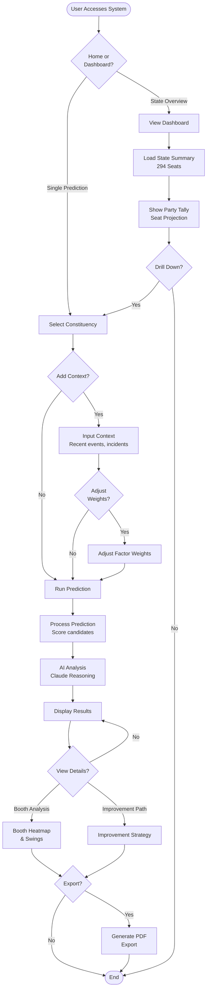
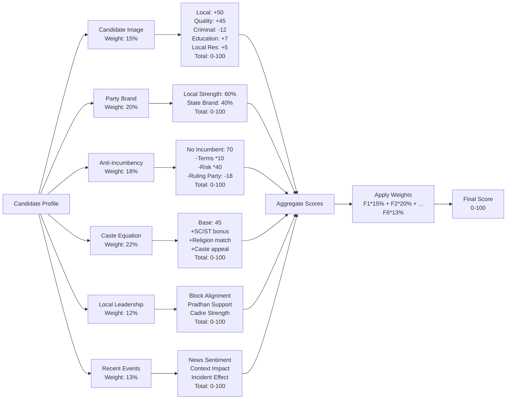
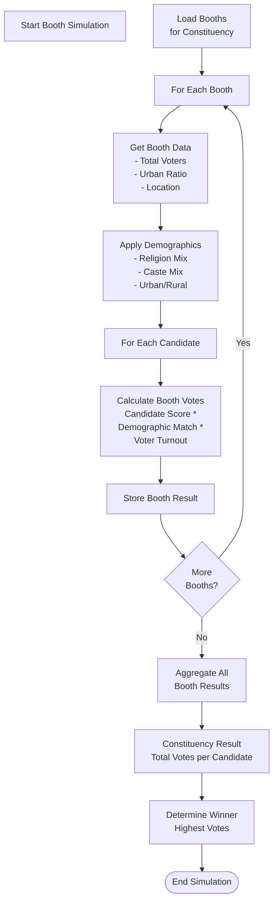
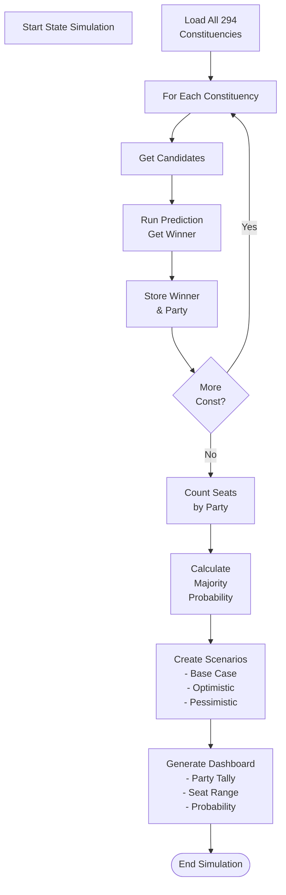
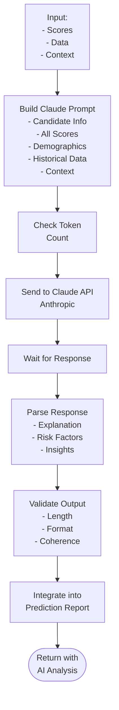
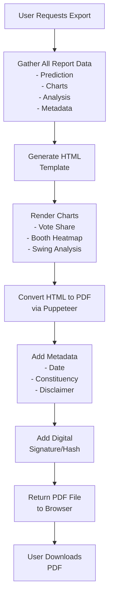
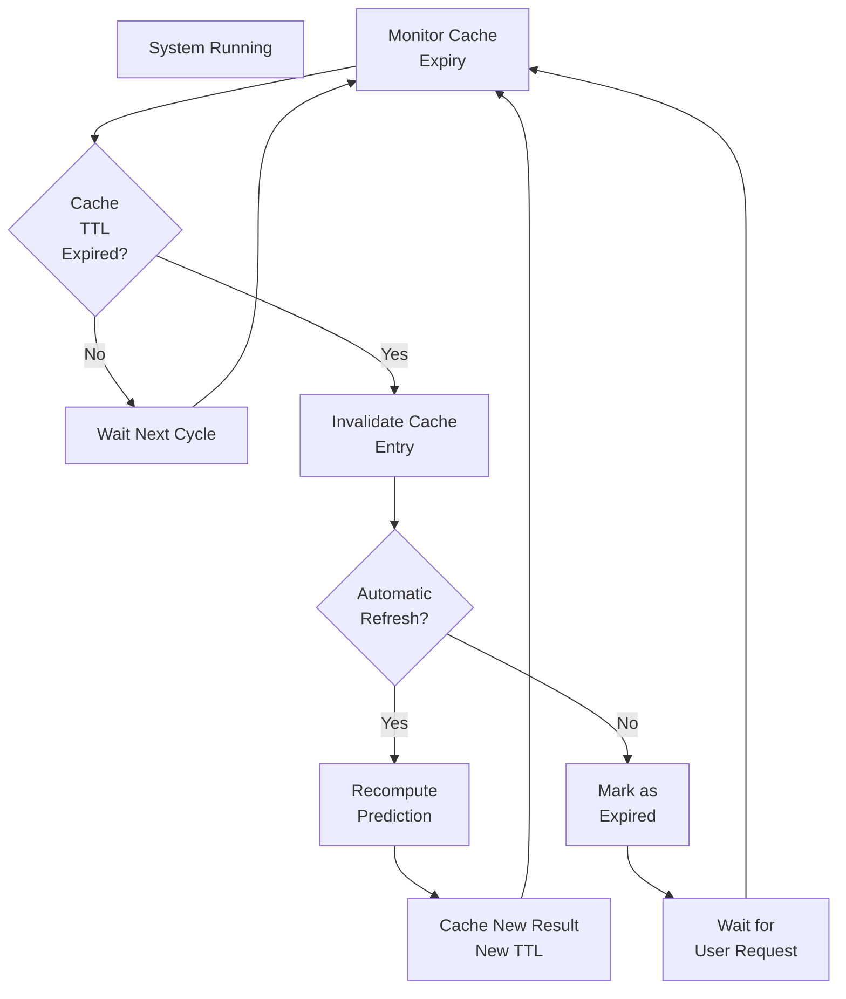
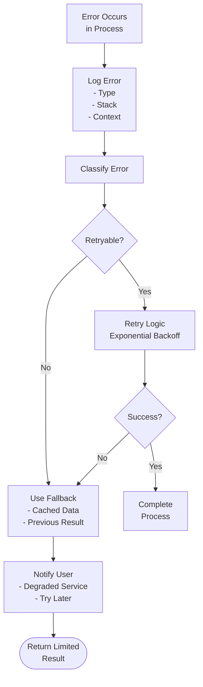
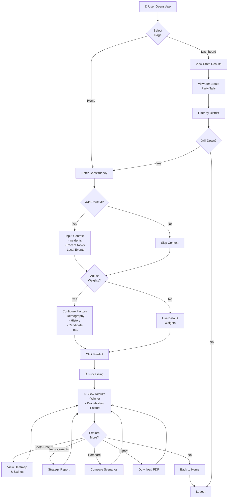

# Business Process Flows

## West Bengal Assembly Election 2026 - Process Documentation

---

## 1. Overall System Flow

---

## 2. Prediction Engine Process

```mermaid
flowchart TD
    Input["Input: Constituency<br/>& Context"]
    
    Input --> LoadData["Load Data<br/>- Candidates<br/>- Demographics<br/>- Historical Results<br/>- Booth Data"]
    
    LoadData --> CheckCache{Cache<br/>Available?}
    
    CheckCache -->|Yes| UseCached["Use Cached Data"]
    CheckCache -->|No| ProcessData["Process Data"]
    
    UseCached --> ScoreLoop["For Each Candidate"]
    ProcessData --> ScoreLoop
    
    ScoreLoop --> ScoreImage["Score Candidate Image<br/>- Local Presence<br/>- Personal Quality<br/>- Criminal Record<br/>- Education"]
    
    ScoreImage --> ScoreBrand["Score Party Brand<br/>- State Popularity<br/>- Local Strength<br/>- Media Presence"]
    
    ScoreBrand --> ScoreAnti["Score Anti-Incumbency<br/>- Ruling Party Fatigue<br/>- Personal Incumbency<br/>- Local Grievances"]
    
    ScoreAnti --> ScoreCaste["Score Caste Equation<br/>- Category Match<br/>- Community Support<br/>- Reserved Status"]
    
    ScoreCaste --> ScoreLocal["Score Local Leadership<br/>- Block President<br/>- Pradhan Alignment<br/>- Cadre Strength"]
    
    ScoreLocal --> ScoreEvents["Score Recent Events<br/>- News Analysis<br/>- Incident Impact<br/>- Context Input"]
    
    ScoreEvents --> CalculateComposite["Calculate Composite Score<br/>Weighted Sum"]
    
    CalculateComposite --> BoothSim["Run Booth Simulation<br/>Aggregate Votes"]
    
    BoothSim --> DetermineWinner["Determine Winner<br/>Highest Votes"]
    
    DetermineWinner --> CalcProbability["Calculate Winning<br/>Probability<br/>Confidence %"]
    
    CalcProbability --> AINarrative["Generate AI Narrative<br/>Claude Analysis"]
    
    AINarrative --> Output["Output: Prediction<br/>- Winner<br/>- Vote Shares<br/>- Probability<br/>- Explanation"]
    
    Output --> CacheResult["Cache Result<br/>TTL: 1 hour"]
    
    CacheResult --> End([End])
```

---

## 3. Candidate Scoring Detail

---

## 4. Booth Simulation Process

---

## 5. State-Wide Election Simulation

---

## 6. AI Reasoning Process

---

## 7. PDF Export Process

---

## 8. Data Refresh & Cache Invalidation

---

## 9. Error Recovery Process

---

## 10. User Workflow - Prediction Journey

